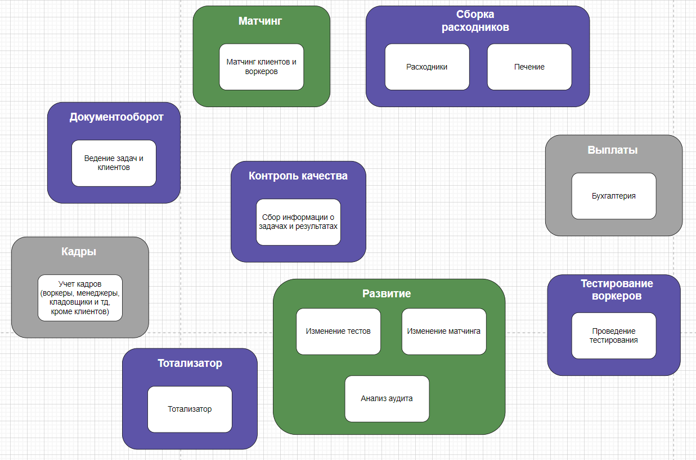

# Sub-domains

> выпишите все поддомены, которые вы нашли в системе

Гавная проблема, которую решает MCF - это борьба с утомляемостью котов-тестировщиков через уменьшение сторонней работы котов. 

Предполагаемые подразделения MCF:
1. Отдел сборки расходников [US-130] - склад
2. Бухгалтерия - выплаты
3. Отдел кадров - учет котов
4. Рекрутинг - тестирование воркеров [US-080]
5. Отдел по изучению качества работы [US-170]  [US-275]
6. Отдел развития [US-180] - те, кто меняют тесты и матчинг

Поддомены:
1. Сборка расходников 
2. Выплаты 
3. Тотализатор 
4. Кадры
5. Тестирование воркеров
6. Контроль качества
7. Развитие
8. Матчинг
9. Документооборот

> текстом опишите логику, по которой были выбраны поддомены

Все из отделов, кроме тотализатора. Отдела такого нет, но выплаты есть. Так как выплаты не через бухгалтерию и без учета, появился такой поддомен.

Отделы взяты из требований и ответа на вопрос "кто и где это делает".
- склад, тестирование и качество есть прям названия в требованиях
- бухгалтерия и кадры из реального мира
- развитие упоминается в 2-х местах (про изменение тестов и матчинг)
- матчинг - это то, что выделяет компанию (написано в контексте до требований)
- документооборот - я не знаю куда положить само ведение задач и все что с ними связано, это кто-то что-то должно делать. И раз в другие места не пододит, то новый поддомен

# Core Domain Chart

> определите все типы поддоменов и заполните core domain chart
> опишите логику, по которой был выбран тот или иной тип поддомена (можно повторить таблицу из урока)

| Вид поддомена         | Конкурентное преимущество | Сложность доменной модели | Изменчивость | Варианты реализации | Интерес проблемы | Предполагаемый вид поддомена |
| --------------------- | ------------------------- | ------------------------- | ------------ | ------------------- | ---------------- | ---------------------------- |
| Сборка расходников    | нет                       | низкая                    | редкая       |                     | низкий           | supporting                   |
| Выплаты               | нет                       | высокая                   | редкая       | Готовое ??          | низкий           | generic                      |
| Тотализатор           | нет                       | низкая                    | редкая       |                     | низкий           | supporting                   |
| Кадры                 | нет                       | низкая                    | редкая       |                     | низкий           | generic                      |
| Тестирование воркеров | нет                       | высокая                   | частая       |                     | низкий           | supporting                   |
| Контроль качества     | нет                       | низкая                    | редкая       |                     | высокий          | supporting                   |
| Развитие              | да                        | высокая                   | частая       |                     | высокий          | core                         |
| Матчинг               | да                        | высокая                   | частая       |                     | высокий          | core                         |
| Документооборот       | нет                       | высокая                   | редкая       |                     | высокий          | supporting                   |

# Bounded Contexts

> определите боундед-контексты для каждого из поддоменов, основываясь на требованиях

# Find Differences

> сравните полученные боундед-контексты из поддоменов и боундед-контексты, полученные из ES. Опишите, что разошлось (можно показать на картинке в сравнении) и предположения, почему так получилось

Много что в итоге совпало, разница такая:
1. Матчинг выделился из задач в отдельный поддомен и контекст
	1. причина: судя по контексту до требований - это самый важный кусок для компании и следовательно будет сложным, меняющимся и критичным. Изначально выглядел как обычное действие
2. Появились кадры
	1. в первой домашке у меня каша с тем где хранятся коты-сотрудники, менеджер вообще был в анализе... С реальным миром, где есть отдел кадров, вроде выглядит логичнее. 
	2. причина: по требованиям и процессам их нет, число по бизнес-операциям они не появлялись.
3. Появилось развитие и 3 контекста внутри: анализ, изменение тестов, изменение матчинга 
	1. причина: упустил важность матчинга в первой домашке, а так же не продумал кто и где будет делать анализ и менять и тесты, и матчинг, как самые критичные части системы.
4. Склад разбился на 2 контекста: расходники и печенье
	1. причина: я, на самом деле, не уверен, что это верно, но подумал, что поставщик печенья может поменяться и это будет легче исправить не затрагивая расходники, которые важны для выполнения задая, когда без печенья можно продолжать работать.
5. Нотификации удалены как отдельный контекст
	1. причина: это был тенический контекст, бизнес часть находится в конктерных местах, так как они знают что, кому, когда посылать. Т.е. формирование тела сообщения, и параметров просиходит в необходимые моменты внутри каждого контекста. 

# New Event Storming Model

> сделайте исправленную версию ES-модели и модели данных
> если нашли места, где бизнес-команда разбилась на технические шаги, — отметьте эти места на модели

_Времени не хватает на добавление информации о нотификациях, да и, наверное, это засорит модель. Нотификации предполагаются в тех местах, на которые есть требования._

https://miro.com/app/board/uXjVK42FnXI=/?share_link_id=419611929861

Overview _(for full resolution check out miro link)_

# New Data Model

[drawio file](assets/HW2_Data_Model.drawio)

Overview

# Characteristics

> выпишите характеристики, важные для проекта. В нашем случае мы не можем спросить у бизнеса, что важно, а что нет;
> для каждой найденной характеристики укажите место, где она была взята

Из описания и требований
1. компания планирует расширяться в будущем - Scalability
2. Деньги на данный момент не критичны - 
3. [US-081]наши конкуренты могут попытаться нас заддосить - Securability, Reliability, Availability, Maintainability, Performance, Supportability
4. [US-090] возможность конфигурировать набор тестов - Agility, Testability, Deployability, Usability
5. [US-260] тотализатор вряд ли будет часто меняться - 
6. необходим низкий ТТМ - Modifiability, Agility, Testability, Deployability, Maintainability
7. критично проверять новые гипотезы по отсеву котов и изменять уже существующие с максимальной скоростью и надёжностью. - Agility, Testability, Deployability

Предположение из находок и логики:
1. Сборка расходников (sup) - Scalability, Securability, Performance, Usability, Simplicity, Supportability
2. Выплаты (gen) - Securability, Usability, Simplicity, Supportability
3. Тотализатор (sup) - Securability, Usability, Simplicity
4. Кадры (gen) - Securability, Performance?, Supportability
5. Тестирование воркеров (sup) - Scalability, Modifiability, Maintainability, Securability, Performance, Agility
6. Контроль качества (sup) - Scalability, Usability, Simplicity, Supportability
7. Развитие (core) - Scalability, Modifiability, Agility, Supportability
8. Матчинг (core) - Availability, Scalability, Modifiability, Maintainability, Securability, Performance, Agility, Testability, Deployability, Supportability
9. Документооборот (sup) - Availability, Scalability, Maintainability, Securability, Performance, Agility, Testability, Deployability, Usability, Simplicity, Supportability

Получается:
1. Есть части, которые не будут меняться (или крайне редко)
2. Есть сложные и часто-меняющиеся
3. В сумме: 
	1. Важно: Scalability, Modifiability, Agility, Availability, Maintainability, Performance, Testability, Deployability, Supportability
	2. Средне: Securability, Usability, Simplicity, fault-tolerance
	3. Не важно: Cost

# Architectual Style

> выберите один из четырёх архитектурных стилей, описанных в уроке. Опишите, почему вы сделали такой выбор и по каким характеристикам сравнивали стили (можно использовать картинку из урока со сравнением стилей)

**microservices**
Очевидно, если деньги не важны (как заявлено), при этом есть желание расти и менять одну из частей часто и быстро выводит на рынок (т.е. быстро менять 1 часть с минимальным тестированием), то выбор из 4-х стилей в пользу microservices, так как они выигрывают по всем параметрам кроме цены и preformance. Цена не важна, а performance средней важности.

# Final Service Model

> сделайте итоговую модель системы, укажите виды коммуникаций между элементами, если выбрали распределённый стиль.

- _Я не уверен в типах коммуникаций, где-то я выбрал async потому что можно не ждать (типа в пеймент улетает асинхронно потому что выплаты не сразу), где-то async с предположением, что в другом сервисе будет копия, а где-то не решился и оставил sync_
- _Ещё одно. Дабы не засорять модель убрал комуникации к кадрам, они почти везде нужны и пока сделал из сервисов в кадры (sync из-за этого), но сомневаюсь_

**[drawio file](assets/HW2_Service_Model.drawio)**

Overview

