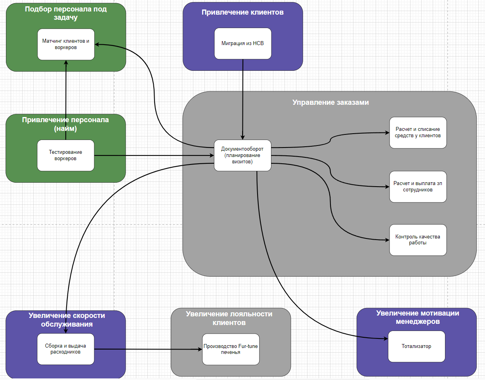
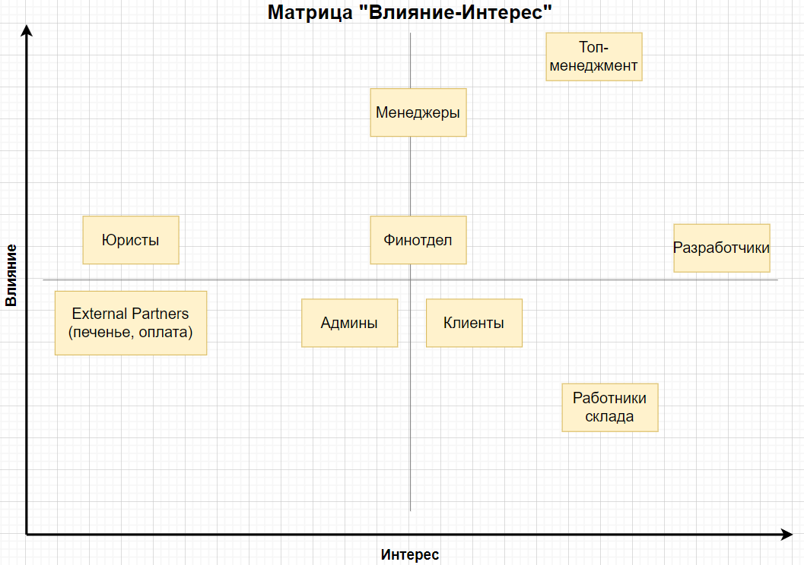
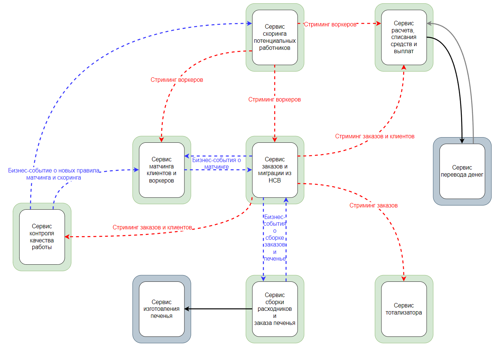
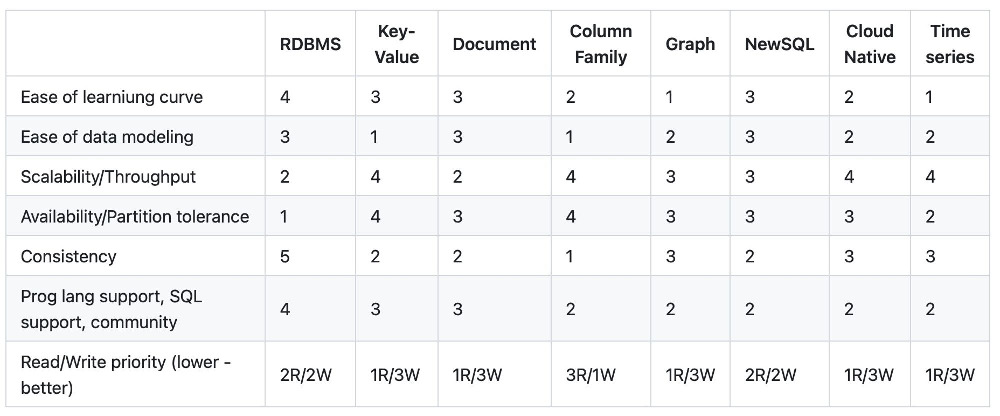

# ES, Data Model и Bounded Contexts

Исправленный вариант после разбора домашки 2. 
ES https://miro.com/app/board/uXjVK42FnXI=/?share_link_id=821369807039 
(Data Model не успеваю переделать)

---

# Stakeholders

> попробуйте расписать стейкхолдеров по группам из урока. Попутно пофантазируете, кого потенциально мы забыли указать в списке стейкхолдеров;

|                                     | Informed                                                     | Committed                                                    | Authorized                                                   | Representative                               |
| ----------------------------------- | ------------------------------------------------------------ | ------------------------------------------------------------ | ------------------------------------------------------------ | -------------------------------------------- |
| Топ-менеджмент                      | **Высокое** Они выдвигали требования и знаю о системе все с точки зрения бизнеса | **Высокое**                                                  | **Низкое** Часть требований уже поменялась                | Есть менеджер Коля, с которым говорили       |
| Менеджеры                           | **Высокое** Они должны знать, что им нужно для работы, а это половина всего. Не факт, что знаю о зказых или складах | **Среднее** Как мне кажется они вряд ли будут заниматься решениями | **Среднее** Возможно появятся новые. Старые требования скорее всего останутся | Ну пусть там есть пара вовлечены котов       |
| Финотдел                            | **Высокое** Они должны знать, что им нужно для работы с фин точки зрения | **Среднее** Как мне кажется они вряд ли будут заниматься решениями | **Высокое** Мне кажется они не будут особо ничего менять в плане финансов, если не поменяется законы. Новые типы оплаты или новые отчеты разве что |                                              |
| Разработчики                        | **Среднее** Технари, будут знать тех часть. Ничего не подскажут по бизнесу. | **Высокое** Вся тех реализация                            | **Среднее** По началу будут менять тех решение.           | Team Lead                                    |
| Админы                              | **Низкое** Ничего о бизнесе не знают                      | **Среднее** Могут помочь с установками и настройками      | **Высокое** Они хотят графану и не будут менять мнение до 2050 года | Кото-пес Василий - гик и любитель рок-музыки |
| Юристы                              | **Среднее** Подскажут лимиты по законам и не более того   | **Низкое** Всегда говорят: "Иди-ка ты к Коле"             | **Высокое** Законы, влияющие на систему меняются крайне редко |                                              |
| Клиенты                             | **Низкое** Ничего о бизнесе не знают                      | **Низкое**                                                | **Высокое**                                                  |                                              |
| External Partners (печенье, оплата) | **Среднее** От них могут быть требования или лимиты. Например, не слать более 1 реквеста в минуту (но есть bulk) или быть готовым принять разом все чеки в один момент за месяц - и могут повлиять на архитектуру. | **Низкое**                                                   | **Высокое**                                                  |                                              |
| Работники склада                    | **Среднее**                                                  | **Низкое**                                                   | **Высокое**                                                  |                                              |

# Подбор архитектурного стиля и типа БД

> выберите один из семи архитектурных стилей, описанных в уроке. Опишите, почему вы сделали такой выбор и по каким критериям сравнивали стили (можно использовать картинку из урока со сравнением стилей);
>
>  - если выбрали распределённый архитектурный стиль, опишите, какие сервисы будут отдельно, какой архитектурный стиль будет у каждого из сервисов, и объясните, почему каждый из сервисов должен быть отдельно от остальных;
>
> выберите нужный вид баз данных для каждого из полученных сервисов. Если у вас получился один монолит — определите необходимый вид базы для этого монолита. Опишите, почему вы сделали такой выбор и какие критерии использовали для выбора;

Ограничения:
1. Код и данные во власти компании: производство печенья и золотая шляпа исключения
2. Тотализатор скрыт от всех
3. Хранение на территории страны

Характеристики из требований и домашки 2:

1. Scalability - планируется рост клиентов и заказав
2. Fault-Tolerance, Supportability - защита от ddos [US-081]
3. Agility, Testability, Deployability, Usability - [US-090] возможность конфигурировать набор тестов
4. Modifiability, Agility, Testability, Deployability, Maintainability - необходим низкий ТТМ
5. Деньги не важны
6. Тотализатор редко меняется
7. У матчинга свои термины [US-290] и pipeline [US-300]

Характеристики по ограниченным контекстам:

Agility, Deployability, Testability - TTM - общие для всех

1. (core) Матчинг клиентов и воркеров - _Modifiability_, _Maintainability_, Reliability - из [US-300] набор шагов, который надо конфигурить
2. (core) Скоринг потенциальных работников - _Modifiability_, _Maintainability_, Supportability, Fault-Tolerance, Securability, Configurability, Extensibility - выдача часто и планируется продавать
3. (gen) Документооборот (планирование визитов) - Scalability, Performance, Fault-Tolerance, Usability, Securability
4. (gen) Расчет и списание средств у клиентов - Modifiability, Consistency - хотят добавлять новые способы списывать деньги
5. (gen) Расчет и выплата зп сотрудников - Consistency
6. (gen) Контроль качества работы - Cost
7. (sup) Сборка и выдача расходников - Consistency, Cost
8. (gen) Производство Fur-tune печенья - Consistency, Cost
9. (sup) Тотализатор - Cost
10. (sup) Миграция из HCB - Consistency, Cost

Сервисы:

- Сервис 1 - pipeline, DB=Document
	- **Матчинг клиентов и воркеров**
		- у них свой язык и они делают блоки для pipeline, поэтому отдельный сервис, остальное приложение не должно иметь такую же архитектуру. 
		- DB Document: так как нет сложной структуры, настройки можно хранить как документ для каждого шага, история тоже легко хранится как документ. Такие базы лучше для частого чтения. Нам не так важна consistency, зато availability пригодится.

- Сервис 2 - microkernel (из-за Configurability и планов по продаже), DB=Columnar
	- **Скоринг потенциальных работников**
		- выдача чаще других -> отдельный сервис. 
		- DB Columnar: Больше записи, чтение конфигов плагинов кешируется. Consistency не важно. Важен fault tolerance.

- Сервис 3 - modular monolith, DB=Columnar
	- **Документооборот (планирование визитов)**
		- тут много уникальных и дорогих характеристик
		- DB Columnar: (хочется реляционную но) по характеристикам подходит колоночная или kv (key-value не удобна). Scalability, много записи (документы в процессе, скорее всего будут в кеше и из базы будут читаться редко). Важен fault tolerance.
	- ***Миграция из HCB***
		- работает 1 раз и не меняется больше никогда. Дешево реализовать Consistency если будет доступ к БД клиентов. 

- Сервис 4 - layered monolith, DB=Columnar
	- **Контроль качества работы**
		- этот контекст будет редко меняться и не должен влиять на основной документооборот, а так же тут не важен Performance и можно съэкономить
		- DB Columnar: проще забирать данные из документооборота для анализа в такой же тип БД, consistency не важно, много записи

- Сервис 5 - modular monolith, DB=RDBMS
	- **Сборка и выдача расходников**
		- RDBMS: важна consistency, не важно fault tolerance, есть бесплатные простые реляционные базы
	- ***Производство Fur-tune печенья***
		- все в складе для одной и той же команды котов, термины общие, характеристики одинаковые

- Сервис 6 - layered monolith, DB=Key-Value
	- **Тотализатор**
		- должен быть спрятам ото всех, вынесем в отдельный неймспейс и закроем его правами, соответсвенно нужен отдельный сервис
		- KV DB: возможно даже in-memory, так как хранить ничего не надо, выплаты по тетрадке, тут только временное хранение и расчет

- Сервис 7 - modular monolith (путаницу с терминами убираем модулями, но все в одной базе), DB=RDBMS
	- **Расчет и списание средств у клиентов**
		- это контекст планируется менять чаще, но выглядит, что выгоднее объединить все равно, так нужно consistency
		- RDBMS: важна consistency и надежность 
	- **Расчет и выплата зп сотрудников**

# Коммуникации

> выберите нужный стиль коммуникаций и их вид (синхронный/асинхронный). Опишите, почему вы сделали такой выбор и какие критерии использовали для выбора;

1. Асинхронные коммуникации
   1. Заказ оформляется и дальше уходит в матчинг, он может выпасть и в ручную таску (в требованиях этого нет, но в реальной жизни такое бывает, у нас есть credit check на работе и там бывает manual check в редких случаях). В любом случает если делать матчинг синхронным, то вырастают требования на Performance, Scalability, Availability чего нет в требованиях.
   2. Матчинг отвечает асинхронно, так как и запрос асинхронный
   3. Сборка расходников. Мы делаем любой синхронный запрос на создание сборки (у них это как-то трекается в сервисе, очевидно в виде заяки на сборку), они синхронно отвечат что приняли (ack - это тех ответ, не бизнес), но работа будет долгой и бизнес-ответ будет асинхронным. Поэтому связь асинхронная.
   4. Аналогино с расчетом денег (раз в месяц, не нужен моментальный расчет) и контролем качества
   5. Появляютя новые воркеры, мы из стримим во все сервисы, которым они нужны. Рассинхрон в данном случае не играет роли потому что расчет зп с большой отсрочкой, в заказах нужны только данные воркера (email послать о заказе), а назначение воркера в матчинге. Т.е. проблема может быть только с нотификацией. Тут или ретрай, или вообще не стримить воркеров в заказы и все передавать из матчинга. Хз как лучше
   6. Тотализатор получает обновления через стриминг и это единственный способ его скрыть. Так же тотализатор не должен ничего производить (никаких эвентов или реквестов)

2. Синхронные коммуникации
   1. Синхронные реквесты в сервис по производству печенья. Они должны ответить, что приняли (ack) и дальше будут работать асинхронно. 
   2. Синхронные реквесты в сервис по деньгам. Нужны данные об оплате, поэтому тоже нужен ответ (возможно оно асинхронно сделано, поэтому от них тоже есть реквест, но серым).

# Фитнес-функции

> предположите, какие фитнес-функции можно использовать для валидации итоговой системы. Можете считать, что система будет делаться с использованием любого языка программирования, следовательно, можете выбрать любые инструменты из любой экосистемы;

Общие
1. проверка покрытия тестами не ниже 90%
2. проверка периодичности релиза - отчеты от менежмента, админ процесс
3. schema-registry - проверка событий

По сервисам:

1. Матчинг клиентов и воркеров
	1. Стиль - code review с темплейтом где есть пунты, что шаги сделны согласно стилю pipeline
	2. Reliability - нагрузочные тесты JMeter
2. Скоринг потенциальных работников
	1. Стиль - SonarQube с анализом депенденсов (подсказал ChatGPT, надо валидировать, я это все не трогал никогда) что бы убедиться что это microkernel 
	2. Fault-Tolerance - нагрузочные тесты JMeter, статические анализаторы кода, что бы убедиться что rate limiting и другие либы применяются
	3. Supportability - ручное тестирование
	4. Securability, Configurability, Extensibility - авто-тесты
3. Документооборот (планирование визитов)
	1. Стиль - Static Code Analysis
	2. Scalability - нужно как-то убедиться, что нет состояния. Так же можно проверить что есть HPA (если K8s)
	3. Performance, Fault-Tolerance - нагрузочные тесты JMeter, статические анализаторы кода
	4. Securability - авто-тесты
	5. Usability - Административно установленный процесс по апруву UI и все процессов, через которые проходит пользователь
4. Контроль качества работы
	1. Стиль - ArchUnit
5. Сборка и выдача расходников
	1. Стиль - Static Code Analysis
	2. Consistency - авто-тесты
6. Тотализатор
	1. Стиль - ArchUnit
7. Списание и выплаты
	1. Стиль - Static Code Analysis
	2. Modifiability - ручные тесты
	3. Consistency - авто-тесты

# ADR

> сделайте ADR, опишите принятие решения по изоляции одного из элементов как изолированного сервиса.

Опишу тут же, без выноса в отдельный файл, так удобнее для домашки.

## ADR-001: Выбор БД для сервиса "Скоринг потенциальных работников"

### Status
Accepted
### Context
Данный сервис образован из **core** bounded context и к нему предъявлены допольнительные требования от стейкхолдеров в лице топ-менежмента.
1. Скоринг будет очень сложным и будет часто меняться
2. Планируется продажа решения, а значит к нему предъявляются повышенные требования к кастомизации и настройке
3. Релизный цикл - неделя

Характеристики важные для этого сервиса определены так:
- _Modifiability_, _Maintainability_ - ТТМ и короткий релизный цикл
- Supportability, Fault-Tolerance, Securability, Configurability, Extensibility - из-за планов на продажу

Ожидания от БД:
- Хранение конфигов для плагинов - ключ-значение
- Хранение результатов тестов - ключ-значение по кандидату
- Read / Write = 1 / 3 - много записи, мало чтения (конфиги должны кешироваться, а не читаться каждый раз из БД; чтение истории редкое)
### Decision
Columnar DB

Выбор обоснован таблицей, характеристиками и ожиданиями

Как видно из таблицы подходят kv и column базы по характеристикам надежности и доступности, при не важности высокой consistency и сложной структуры. Однако, из оданий видно, что большее количество записей однозначно определяет column family как базу данных выбора.
### Сompliance
Делать автоматическую проверку типа БД не целесообразно, так как выбор делается крайне редко. В контектсе этого сервиса выбор БД произойдет при изначальной реализации и, возможно, в одной из следующих мажорных версий сервиса. Следовательно, проверка должна быть реализована административным путем, а именно утверждением архитектора.
