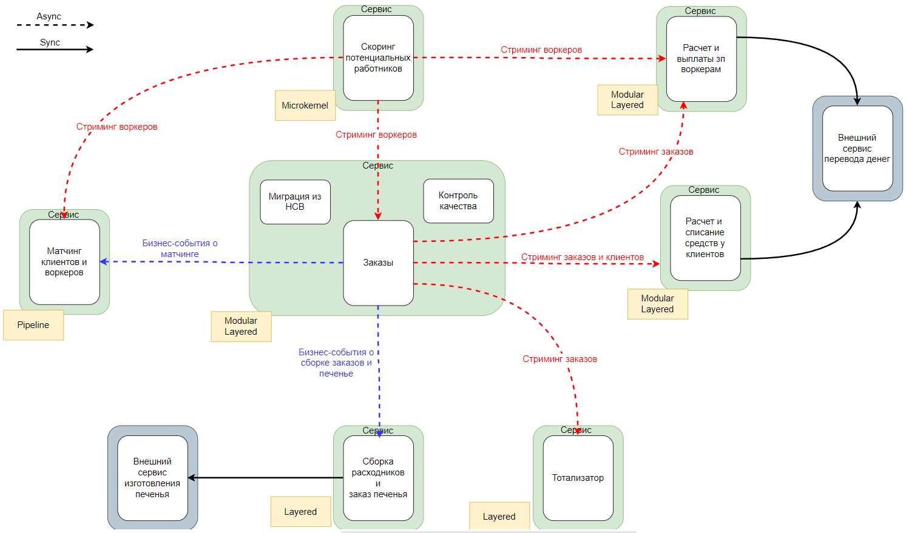
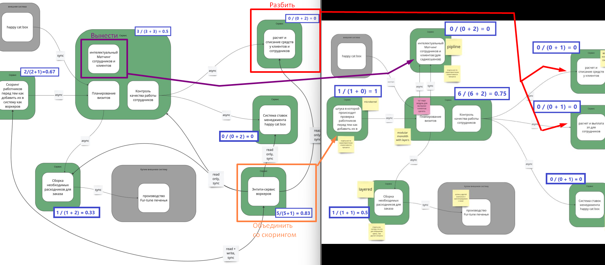

# Исправленная домашка 3

# 1. Instability
> для каждого сервиса, который добавится или удалится и связанных с ним сервисов посчитайте значение instability;

Открытые вопросы и недопонимания:
1. Если честно я не понимаю почему после объединения entity service-а и скоринга стало меньше связей. Всем как надо было получать воркеров так и осталось... В моей картинке "исправленная 3-я домашка" из скоринга 3 исходящих связи именно по этому.

# 2. Изменения
> опишите, какие сервисы и боундед-контексты в каком месте и каким образом будут меняться;

1. Вынести матчинг в отдельный сервис, потому что у него высокие требования по настройке, скорости, скейлингу и он core, а заказы пока generic
2. Разбить выплаты зп и принятие денег от клиентов на 2 сервиса, потому что не пересекающиеся бизнес-процессы, разные значения одних терминов (invoice значит разное) и у принятия оплаты доп харатеристика Modifiablity
3. Объединить Entity Service содержащий воркеров с сервисом скоринга, так как решено использовать Event-Driven стиль коммуникаций воркеров и отдельный сервис не нужен (не важно откдуа стримить), так как создает дополнительные связи и повышает общую сложность системы

# 3. План

**Когда свободных людей и ресурсов нет, а опыт и (или) инфраструктура есть**
1. Матчинг - core
2. Разбить выплату зп и прием платежей от клиентов на 2 сервиса. Это позволит уменьшить количество ошибок, сложность реализации, получить возможность независимого подключения платежных систем, независимое управление длиной цикла расчетов как удобно бухгалтерии.
3. Объединение entity service-а и скоринга - потому что он создает много ненужных связей.

**Когда есть свободные люди и ресурсы, а опыта и (или) инфраструктуры нет**
1. Объединение entity service-а и скоринга - это не критично для бизнеса, можно потренироваться
2. Разбить выплату зп и прием платежей от клиентов на 2 сервиса. - приносит пользу, но не трогает core части
3. Матчинг - core
