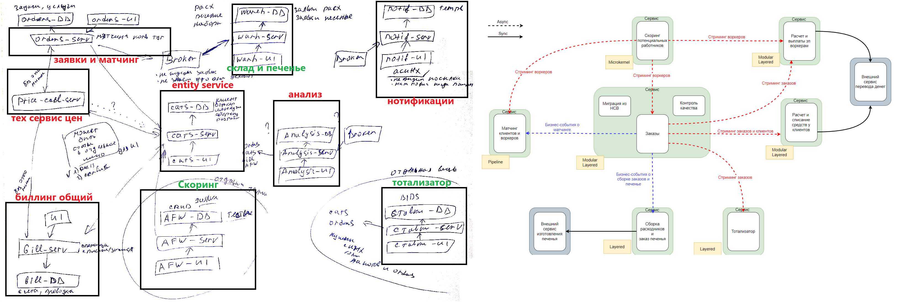

Разница между 0-ой и 4-ой домашкой.

Красным помечены "не верные" решения в 0-ой, зеленым "верные".

> Хочу отметить, что требования немного менялись, хотя и не значительно и я изначельно предполагал, что матчинг будет сложным, т.е. в моей 0-ой я думал о матчинге, как о важной штуке (но не вынес отдельно).

Разница:
1. **Матчинг и заявки** объединены. Сделал я это потому что в целом это про одно и тоже. Про характеристики я ничего не знал и принял такое решение без них. Оказалось, что разница не только в характеристиках, но и в поддоменах: один core, второй generic (или supporting)
2. **Расчет цен** как отдельный сервис. Я не думаю, что это прям ошибка, потому что в жизни это может быть довольно сложная штуковина, с которой работают отдельные команды (у нас на работе так, более того там не один сервис). Однако, в домашке не было особенных требований для расчета цен и вынос был не оправдан. Я принимал решение из опыта и только из него. 
3. **Биллинг** общий. Много говорили про это, в условиях домашки надо было разделить, так как приход и расход никак не пересекаются. Тут поменялись требования. Не уверен, что бы принял другое решение даже при этом. Опять же все выглядело логичным, да и выглядит. Разделение улучшает характеристики системы по тем требованиям, которые есть в домашке. При других вводных надо разбираться: делать общий сервис или несколько отдельных (например, для отчетов третий). Я пока принял для себя такое решение: если надо вести баланс и между контекстами появится требование strong consistency, то я бы объединил, а не делал бы распределенные транзакции. Во всех остальных случаях - разделить.
4. **Entity Service** котов. В домашке был entity service воркеров, а у меня все коты. Решение из опыта. У нас в компании есть такой сервис для customer-ов. Он нужен для поддержания TMF стандарта, стриминга в другие сервисы нет (кому надо ходят за инфой по кастомеру в этот сервис синзронно), кроме reporting. Тут я сделал так же. В целом идея с распределенным хранением данных (но с один мастером) понятна, плюсь read-данных в синхронных запросах к этому сервису. Тут надо разбираться в каждом случае. У меня опыт немного специфичен и я опираюсь на него. Склоняюсь, что у нас это скорее оправдано, чем нет. В домашке полностью согласен, такой сервис не нужен.
5. **Анализ** вынесен. По требованиям домашки анализ заказов (проваленных и рандомных) выглядело логичным вынести, что бы не "засорять" основные сервисы. Понятно было, что к анализу меньше требования по перформансу, т.е. в голове было тут может надо будет 1-2 поды. Для заказов же надо много и там критичнее, так как оттуда заказы = деньги. Ну вот по характеристикам вышло, что не так уж и важен этот "основной" сервис, который оказался не основным, ну и объединение стало логичным после этого.
6. **Нотификации**. Тут все понятно. Опять же базировался на своем опыте. У нас нотификаций много, они сложные и ими занимается отдельная команда. Я бы не сказал, что там есть какие-то куски контекстов большие. Скорее там ребята собирают темплейты и готовят контракт для запросов от сервисов, которые все данные должны предоставить. Это же и я предполагал. Т.е. тут не будет бизнес-логики по доставанию данных, но чисто логически знания о каждом контексте есть. Некая середина между "плохо" и "технический сервис транспорт, в который отправляют прямо весь готовый текст". В общем, я пришел к выводу, что у нас это оправдано организацией работ, для распараллеливания имплементации. В домашке согласен, выглядит логично. Антон приводил пример FE, что письмо или смс это просто FE другого типа. FE обычно под каждый сервис свой, а не общий для всех.
7. Рад, что 3 сервиса попал, но тут скорее так сложилось, нежели я правильно как-то рассудил. Сложилось, что неучтенные характеристики выдали тоже самое. Кроме тотализатора, там, по-моему, просто очевидно, что он должен был быть отдельно (даже без доп требования).

**Пара слов в конце**
Курс классный, применять негде, архитектором пока не планирую становится, но для расширения кругозора зашел отлично. Некоторые моменты:
1. Визуализация, которой одержим Антон мне нравится, я долго пытался прийти к подобному, отличный пример.
2. Мне было очень интересно и после своих целей вернусь к архитектуре и, возможно, даже подумаю над сменой направления.
3. По сути идея в том, что сервисы - это как байт-код, а домены, под-домены и контексты - это классы, абстракции. Наверное, рано или поздно к такому придешь и сам (а может и нет). Круто, что уже много что есть по этому поводу и есть стандарты, с другой стороны много учить :-)
4. Однозначно буду думать над каждым сервисом "почему он есть", "какую проблему решает", "какие есть связи" в будущем.
5. Если получится так, что буду работать в небольшой конторе, точно буду применять все эти шаги для понимания и описания. Визуальная часть крута.